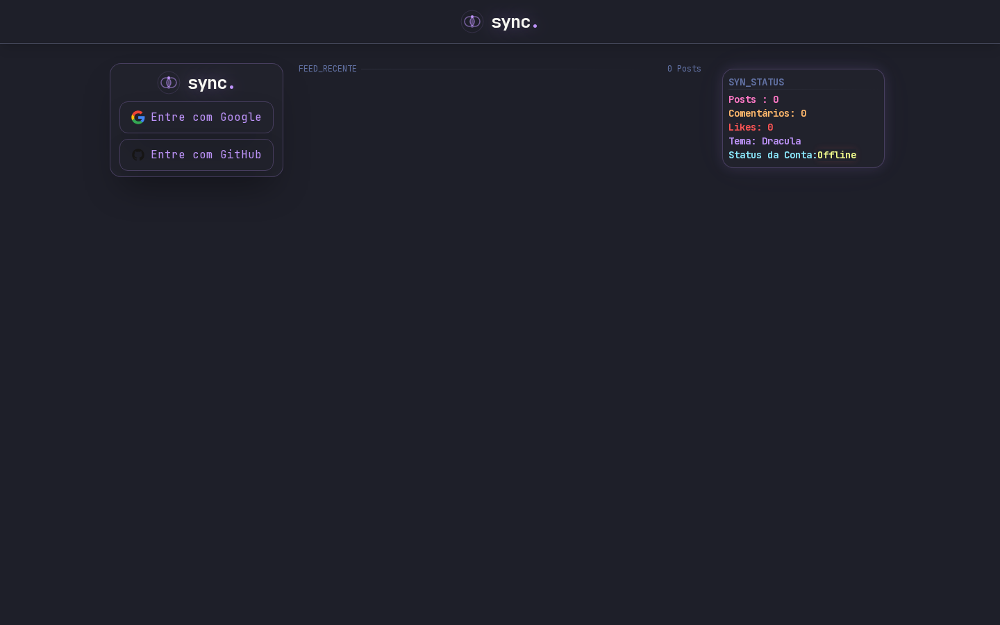

<div align="center">

# ⚛️ dev-sync

**Rede social para desenvolvedores — feed, perfil, likes e comentários, tudo em tema Dracula.** 🦇

[](https://nextjs.org)
[](https://react.dev)
[](https://www.typescriptlang.org)
[](https://tailwindcss.com)
[](https://www.prisma.io)
[](https://www.postgresql.org)
[](https://authjs.dev)
[](https://vercel.com)

**🔗 Acesse em produção: [dev-sync-puce.vercel.app](https://dev-sync-puce.vercel.app)**



</div>

---

## 📌 Sobre o projeto

O **dev-sync** é uma rede social onde desenvolvedores criam um perfil (avatar, capa, cargo, bio e localização) e publicam posts com imagem e legenda, que podem receber **likes** e **comentários**. O sidebar direito exibe o card **SYN_STATUS** com métricas da comunidade em tempo real (posts, comentários, likes e status da conta).

Tudo isso vestindo o **tema Dracula**, com a fonte monoespaçada JetBrains Mono e efeitos de glow roxo/ciano.

## ✨ Funcionalidades

- 🔐 **Login social** com Google e GitHub (OAuth)
- 📝 **Criação de posts** com legenda (5–225 caracteres) e upload de imagem com preview
- ❤️ **Likes** e 💬 **comentários** nos posts
- 👤 **Edição de perfil** com upload de avatar e capa
- 🗑️ Exclusão do próprio post/comentário (autorização no servidor)
- 📊 Card de estatísticas (**SYN_STATUS**) com contadores da plataforma
- 🌙 **Tema Dracula** completo com tokens centralizados e utilitários de glow

## 🛠️ Stack

| Camada | Tecnologia |
| --- | --- |
| Framework | **Next.js 16** (App Router) + **React 19** com React Compiler |
| Linguagem | **TypeScript** |
| Estilo | **Tailwind CSS 4** (tema Dracula + design tokens em `tailwindData`) |
| Autenticação | **Auth.js (NextAuth v5)** com Prisma Adapter — providers Google e GitHub |
| Banco de dados | **PostgreSQL** + **Prisma 7** (driver adapter `@prisma/adapter-pg`) |
| Upload / Storage | **EdgeStore** (`@edgestore/react` + `@edgestore/server`) — armazenamento online |
| Validação | **Zod** |
| Deploy | **Vercel** + Vercel Analytics |

## 🧠 Destaques técnicos

### 1. OAuth com providers (Google + GitHub)

Autenticação via **Auth.js v5** com `PrismaAdapter` persistindo usuários, sessões e contas no Postgres:

```ts
// auth.ts
export const { auth, handlers, signIn, signOut } = NextAuth({
  adapter: PrismaAdapter(prisma),
  providers: [GitHub, Google],
});
```

Nenhuma senha é armazenada: o fluxo OAuth cuida da identidade e o adapter sincroniza tudo com o schema `User/Account/Session` do Prisma.

### 2. Upload de arquivos com armazenamento online

Uploads de **imagem de post, avatar e capa** vão direto para o bucket `publicFiles` do **EdgeStore** via rota API `app/api/edgestore/[...edgestore]/route.ts`. As URLs retornadas são persistidas no Postgres e servidas pela CDN do EdgeStore (domínio liberado no `next.config.ts` para o `next/image`). Server actions como `newPost` e `updateUserProfile` validam a sessão no servidor antes de aceitar qualquer upload.

### 3. CI/CD e refatoração guiada por PR

O desenvolvimento segue um fluxo de **integração contínua com Pull Requests** — cada feature nasce em uma branch, passa por `dev` e só então chega à `main` (deploy automático na Vercel):

```
feature/nome-da-feature ──► PR ──► dev ──► PR ──► main (produção)
```

O diferencial é a **review documentada**: cada PR recebe um checklist de qualidade categorizado (🔴 segurança, 🟡 duplicação/arquitetura, 🟠 UX, 🔵 estilo), gera commits de correção (`fixes da review do pr #9`) e vira um documento em [`docs/changelog/pr-XX.md`](docs/changelog) — um histórico de como o projeto evoluiu e foi refatorado. Exemplos reais desse processo:

- PR #7: review apontou upload sem validação de tipo/tamanho e risco de *path traversal* → refatorado para storage gerenciado (EdgeStore) com `id` derivado da sessão no servidor.
- Versionamento com [Keep a Changelog](https://keepachangelog.com/pt-BR/1.1.0/) + [SemVer](https://semver.org/lang/pt-BR/) no [`CHANGELOG.md`](CHANGELOG.md).

## 🧛 Tema Dracula

A identidade visual segue a [paleta oficial Dracula](https://spec.draculatheme.com/), com classes utilitárias (`text-drac-*`, `shadow-glow-*`) centralizadas em `app/constants/tailwindData.ts`:

| Cor | Hex | Uso |
| --- | --- | --- |
| Background | `#282A36` | fundo da aplicação |
| Current Line | `#44475A` | cards e bordas |
| Foreground | `#F8F8F2` | texto principal |
| Comment | `#6272A4` | textos secundários |
| Purple | `#BD93F9` | marca, links e glow |
| Pink | `#FF79C6` | destaques |
| Cyan | `#8BE9FD` | detalhes e glow |
| Green | `#50FA7B` | sucesso |
| Orange | `#FFB86C` | avisos |
| Red | `#FF5555` | ações destrutivas |
| Yellow | `#F1FA8C` | status |

## 🚀 Como rodar

**Pré-requisitos:** Node.js 20+, pnpm, PostgreSQL e contas no [Google Cloud](https://console.cloud.google.com/), [GitHub Developer Settings](https://github.com/settings/developers) e [EdgeStore](https://edgestore.dev) para as credenciais.

```bash
# 1. Clone o repositório
git clone https://github.com/Rafael-Machado01/dev-sync.git
cd dev-sync

# 2. Instale as dependências
pnpm install

# 3. Configure as variáveis de ambiente
cp .env .env.local  # ou crie o seu .env seguindo a tabela abaixo

# 4. Rode as migrations e gere o client
npx prisma migrate dev

# 5. Suba o servidor
pnpm dev
```

Abra [http://localhost:3000](http://localhost:3000) 🎉

### Variáveis de ambiente

| Variável | Descrição |
| --- | --- |
| `DATABASE_URL` | Connection string do PostgreSQL (Prisma) |
| `DIRECT_URL` | Conexão direta para migrations |
| `AUTH_SECRET` | Segredo do Auth.js (`npx auth secret`) |
| `AUTH_GOOGLE_ID` / `AUTH_GOOGLE_SECRET` | Credenciais OAuth do Google |
| `AUTH_GITHUB_ID` / `AUTH_GITHUB_SECRET` | Credenciais OAuth do GitHub |
| `EDGE_STORE_ACCESS_KEY` / `EDGE_STORE_SECRET_KEY` | Credenciais do EdgeStore |

### Scripts

| Comando | Ação |
| --- | --- |
| `pnpm dev` | Servidor de desenvolvimento |
| `pnpm build` | Gera o Prisma client e faz o build de produção |
| `pnpm start` | Serve o build de produção |
| `pnpm lint` | ESLint |

## 📂 Estrutura

```
app/
├── actions.ts          # Server actions (posts, likes, comentários, perfil)
├── api/                # Handlers do Auth.js e do EdgeStore
├── components/         # NavBar, CardStats, posts/, sidecard/, ui/
├── constants/          # Design tokens do tema Dracula (tailwindData)
├── lib/                # prisma.ts, edgestore.ts, auth-user.ts
└── types/              # Tipos da aplicação
prisma/
└── schema.prisma       # User, Account, Session, Post, Like, Comment
docs/changelog/         # Histórico documentado por PR
```

## 📚 Documentação

- [`CHANGELOG.md`](CHANGELOG.md) — mudanças notáveis por versão
- [`docs/changelog/`](docs/changelog) — detalhes e reviews de cada PR

## 👨‍💻 Autor

Feito por **[Rafael Machado](https://github.com/Rafael-Machado01)** — projeto de estudo de Next.js, Prisma e boas práticas de review/CI, documentado no meu brain pessoal.

<div align="center">

🦇 **What the f*** is going on here?!** — Dracula

</div>
